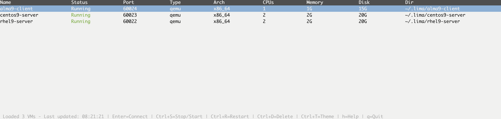
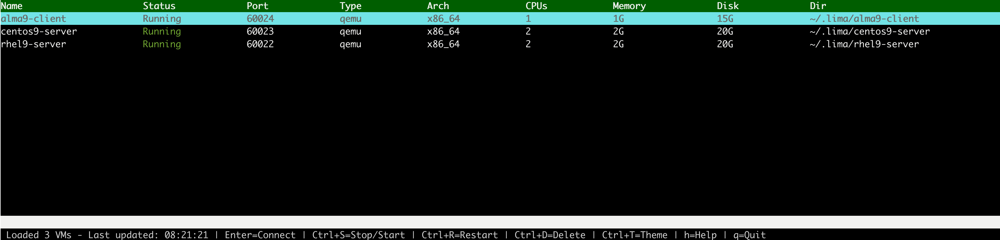

# Lima TUI

A modern Terminal User Interface for managing Lima VMs, inspired by k9s.

Essentially a TUI created in Go with the tview framework. The idea was to improve the built in `limactl list` command with features such as:

- Real-time VM overview
- Intuitive controls for navigation
- VM controls, start/stop/restart
- Connecting to VMs 

## Installation

### Prerequisites
- Go 1.21+ installed
- Lima installed and working
- Access to `limactl` command

### Build from source
```bash
make deps     # Install dependencies
make build    # Build the binary
make install  # Install to /usr/local/bin (optional)
```

## Usage

```bash
# Run the TUI
./lima-tui

# Or if installed globally
lima-tui
```

## Controls

### Navigation
- `↑`/`k` - Move selection up
- `↓`/`j` - Move selection down

### VM Operations
- `Enter`/`Space` - Toggle VM (start if stopped, stop if running)
- `s` - Start selected VM
- `t` - Stop selected VM  
- `r` - Restart selected VM
- `d` - Delete selected VM
- `c` - Connect to VM via SSH

### Management
- `n` - Create new VM (opens external script)
- `R` - Force refresh VM list
- `h`/`?` - Toggle help screen
- `q`/`Ctrl+C` - Quit

## Interface

### Light 



### Dark



## Development

### File Structure
```
lima-tui/
├── main.go          # Application entry point
├── app.go           # Core application logic
├── ui.go            # User interface components
├── actions.go       # VM operations and actions
├── vm.go            # VM data structures and utilities
├── theme.go         # UI theming and styling
├── go.mod           # Go module definition
├── go.sum           # Dependency versions (auto-generated)
├── Makefile         # Build automation
└── README.md        # This file
```

### Dependencies
- [tview](https://github.com/rivo/tview) - Rich TUI framework
- [tcell](https://github.com/gdamore/tcell) - Terminal cell-based display

## Troubleshooting

### VMs not showing up
- Ensure `limactl list` works in your terminal
- Check that Lima is properly installed
- Verify VM permissions

### Build issues
- Ensure Go 1.21+ is installed: `go version`
- Run `go mod tidy` to fix dependencies
- Check network access for Go modules

### Performance issues
- Reduce refresh interval in code if needed
- Check system resources with many VMs
